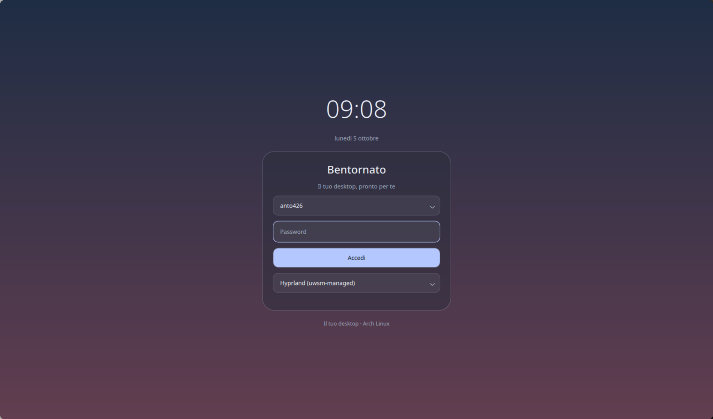
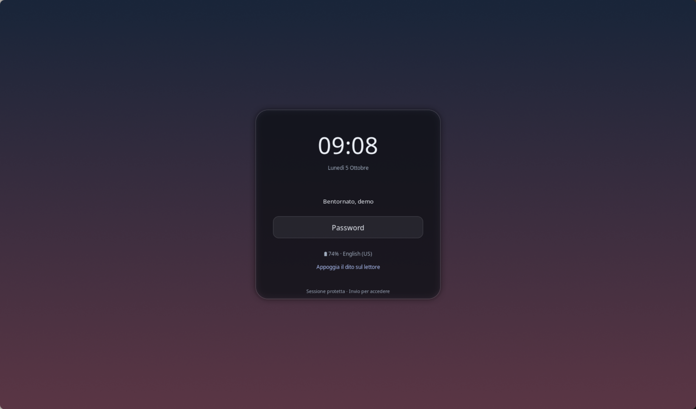

# Login, lock e GRUB — 5 ottobre 2026

Login e lock usano un pannello compatto centrato. I token di spaziatura, raggi,
tipografia e materiale provengono da `design/tokens.json`, come quelli della
shell. La palette segue lo sfondo e include errore, avviso e successo. Gli
asset installati sono copie dei sorgenti versionati, separate dalla generazione
dei colori.

Il login è riscritto in Qt6, con componenti distinti e configurazione tipizzata.
Gestisce utente, sessione, tastiera, alimentazione, password e messaggi PAM.
Durante l’autenticazione blocca gli invii duplicati; dopo un errore cancella la
password e ripristina il focus. Mantiene l’avvio dell’autenticazione senza
password quando la preferenza esistente `AllowEmptyPassword` lo consente.
Le API sono state controllate sia nella [documentazione SDDM](https://github.com/sddm/sddm/wiki/Theming)
sia nei [sorgenti del proxy](https://github.com/sddm/sddm/blob/develop/src/greeter/GreeterProxy.h).
La sfocatura usa [Qt6 MultiEffect](https://doc.qt.io/qt-6/qml-qtquick-effects-multieffect.html).

Hyprlock usa PAM per la password e fprintd in parallelo per l’impronta. Il
lettore Goodix rilevato ha un’impronta registrata; nella prova annidata Hyprlock
ha acquisito il dispositivo e avviato la verifica. Il prompt compare nel
pannello. Non sono stati cambiati PAM né le impronte registrate. Le opzioni
sono verificate con [Hyprlock 0.9.6](https://wiki.hypr.land/Hypr-Ecosystem/hyprlock/)
e con il parser in esecuzione; sono rimossi il colore non valido e
`fail_transition`, non più supportato. I testi esterni sono limitati e protetti
per il markup Pango.

GRUB ha un unico layout di titolo, elenco, countdown e comandi, con selezione a
nove parti e font proporzionato. Sono rimossi i riferimenti a cornici terminale
inesistenti e l’immagine separata dei suggerimenti. Il renderer usa la stessa
geometria per testo e pannello; i cambi dei sorgenti e dei token invalidano la
cache. Le immagini e tutti i componenti del tema vengono preparati prima del
commit nei due temi di sistema. Il vetro GRUB è pre-renderizzato, poiché non
esiste un compositore live nel menu di avvio.

Verifiche: 32 test CTest, form Qt6 su 1280×800, 1920×1080, 800×600 e 480×800;
SDDM reale in test mode e Hyprlock reale in un compositore Wayland annidato.
Il lock conserva password e impronta abilitate durante la prova. Il greeter
in test mode non autentica e non esegue azioni di alimentazione. Il report è
`login-lock-verification.json`. I preset GRUB sono generati dalla stessa fonte
nel repository `grub2-themes`, con hash in `design-source.json`.

Non sono stati eseguiti logout, riavvio o autenticazione reale: restano da
verificare lo sblocco con il dito e l’aspetto di GRUB sul framebuffer di avvio.
Il test annidato non dimostra l’autenticazione biometrica riuscita.

