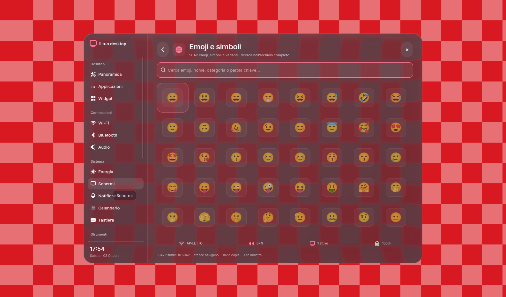
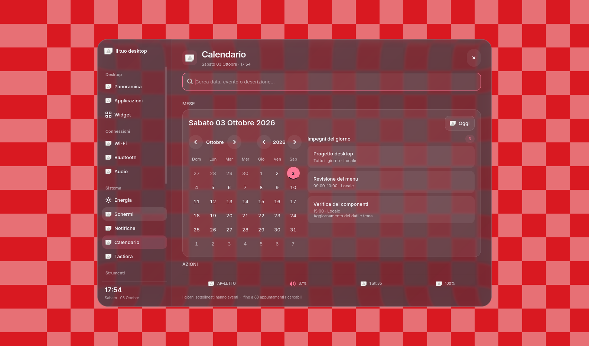
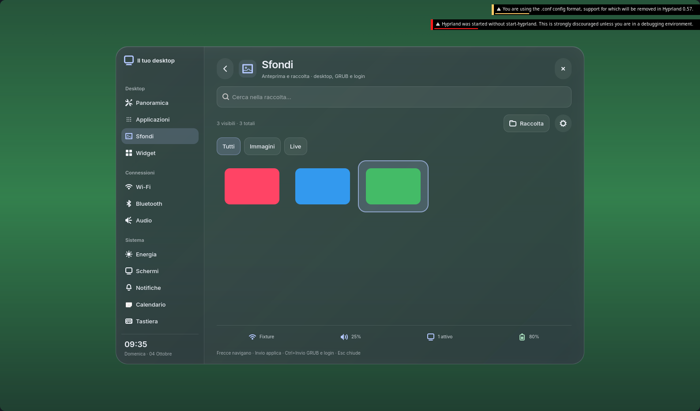
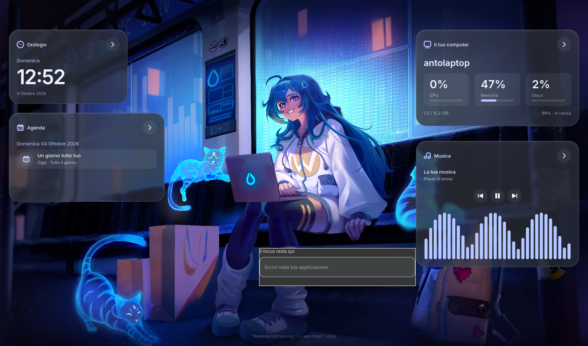

# Ricostruzione Anto Desktop — 4 ottobre 2026

La nuova shell è compilata e installata. La struttura del menu, le primitive condivise, la composizione delle pagine principali e la galleria sono state riprogettate. Il backend ora separa contratti, controller e provider. Gli algoritmi dei dispositivi e diversi adattatori di compatibilità provengono dal progetto precedente: la ricostruzione non equivale a riscrivere ogni algoritmo né dimostra un miglioramento generale delle prestazioni.

## Sorgenti e responsabilità

| Percorso | Responsabilità |
| --- | --- |
| `native/menu/src/core/window.c` | Host trasparente e pannello centrato con dimensioni vincolate |
| `native/menu/src/ui/{sidebar,header,content,status}.c` | Composizione della shell |
| `native/menu/src/ui/{bindings,rows,tiles,sliders}.c` | Binding e azioni dei componenti del menu |
| `native/menu/src/modules/<pagina>/{view,state,actions,bindings}.c` | Composizione, dati e azioni della pagina; file presenti secondo necessità |
| `native/menu/src/core/{navigation,input,live,context}.c` | Navigazione, tastiera, aggiornamento e stato del desktop |
| `native/common/include/primitives.h`, `native/common/src/ui` | Primitive GTK comuni a menu, galleria e OSD |
| `native/common/assets/{primitives,material}.css.in` | Aspetto dei controlli e materiale ottico condivisi |
| `design/tokens.json`, `design/surface-controls.json`, `scripts/design.py` | Token e adattamento delle stesse regole ai widget nativi, Waybar e SwayNC |
| `native/common/src/{query,palette,glass,size_bin,frontend}.c` | Query asincrone, palette, protocollo Wayland del vetro, limiti geometrici e apertura esclusiva dei frontend |
| `native/wallpaper/gallery/{window,header,toolbar,content,preview,footer,state,actions}.cpp` | Parti della galleria GTK4 in C++20 |
| `native/wallpaper/{catalog,apply}.cpp` | Catalogo/cache e avvio indipendente del job sfondo |
| `native/wallpaper/wallpaper_core.c` | Applicazione degli sfondi e unico generatore della palette |
| `native/services/src/runtime` | Comandi, protocollo, validazione e persistenza comuni |
| `native/services/src/domains` | Contratti e controller dei servizi; provider per le integrazioni |
| `native/shell/assets/{waybar,swaync}.css.in` | Composizione e stati delle superfici esterne |
| `native/widgets/{core,data,views}` | Motore GTK4, servizi condivisi e un file dichiarativo per ciascuna scheda |
| `.config/hypr/conf/glass.conf`, `support/patches/hyprglass-layer-shape.patch` | Preset e adattamento del renderer del compositore |

I binari si compilano prima dell'installazione. I file in `build/design` e gli stili installati sono derivati dai sorgenti e dai token. Le preferenze modificabili stanno in `~/.config/anto426-local`, i dati in `~/.local/share/anto426`, cache e stato nelle rispettive directory XDG. Nessun nuovo backup è stato creato.

## UI e aggiornamento dei dati

Menu e galleria condividono il limite di 1080 × 740 pixel logici, con riduzione in base all’output. La raccolta occupa la pagina del menu e scorre al suo interno. L’immagine di anteprima è una superficie visiva separata dietro il menu e non può allargare il pannello.

Le factory della galleria riusano le celle e il catalogo mantiene la cache delle immagini. I task del catalogo e della preview verificano generazione e ciclo di vita della vista prima di consegnare il risultato. La finestra può essere distrutta durante un caricamento senza aggiornare un oggetto ormai eliminato. Ricerca, filtri, selezione iniziale e stati vuoti sono verificati con una fixture della vera UI.

La galleria è integrata nella finestra del menu principale attraverso `gallery_page.h`, con navigazione, ricerca e dimensioni condivise. `anto-wallpaper` conserva le funzioni CLI e inoltra l’apertura alla pagina Sfondi. La selezione mostra una superficie visiva temporanea, senza input, sotto il menu: il compositore campiona questa immagine attraverso il vetro. Il cambio immagine usa una dissolvenza di 180 ms. La superficie scompare quando si lascia la pagina o si chiude il menu. La pagina mostra la raccolta a larghezza piena; riquadro di anteprima, nome file, descrizione e pulsanti inferiori sono rimossi. Ricerca, H/J/K/L, paginazione e Invio seguono il comportamento del backup legacy. Le quattro frecce spostano subito la selezione nella raccolta anche quando il focus è sulla ricerca o sui filtri, aggiornando l’anteprima e portando in vista la tessera. Esc chiude sempre il menu; il pulsante Indietro e Ctrl+Backspace mantengono la navigazione alla pagina precedente.

L’applicazione passa `ALL`, chiude il menu e avvia un worker indipendente. La prova trattiene il worker con una barriera e verifica la chiusura; i test non cambiano lo sfondo reale. GRUB e login è attivo nelle impostazioni e parte automaticamente insieme agli altri moduli al cambio sfondo. Il job usa lock separati per desktop e avvio/login, prepara gli asset in una generazione privata e verifica tutti i percorsi prima di installarli. La cache include versione dell’algoritmo e dimensioni del canvas. La fixture verifica preferenza attiva/disattiva, aggiornamento separato, assenza di blocco sul lock e conservazione del desktop. Il tema installato è stato aggiornato con lo sfondo corrente; resa al riavvio non ancora verificata. Gli errori vengono registrati e notificati.

Il calendario visualizza tutti gli impegni della data selezionata nella colonna destra, con orari, fonte e descrizione, conteggio ed esplicito stato vuoto. La riconciliazione conserva le righe che non sono cambiate. La fixture verifica cinque eventi nello stesso giorno, cambio di data e aggiornamento dei dati. I giorni con eventi e il giorno selezionato usano stati GTK distinti e colori della palette.

La griglia emoji usa la stessa primitive di tessera e collezione della shell. La selezione GTK blu è sostituita dal colore semantico corrente. Il font Noto Color Emoji rende anche i simboli che prima apparivano monocromatici, senza cambiare i caratteri copiati. Il numero di colonne si adatta allo spazio; le frecce verticali seguono le colonne effettivamente allocate. Una fixture controlla i pixel renderizzati della selezione e del glifo, oltre alla navigazione in una finestra stretta.

Il contorno di tutti i margini comparso all'apertura derivava dalla regola universale `*:focus-visible`. Ora il contorno è limitato ai controlli interattivi. La fixture comune del vetro forza quello stato sull’host trasparente e verifica sia i pixel esterni sia il pannello effettivamente renderizzato. Verifica anche realizzazione, distruzione della superficie, riapertura e chiusura; i test rifiutano gli avvisi critical di GTK, GDK e GLib.

La barra laterale allinea le icone in una colonna fissa e i testi a sinistra attraverso la primitiva di navigazione condivisa. La voce Sfondi apre la galleria integrata. La colonna è vincolata a 200 pixel logici (60 nella variante compatta) e non partecipa alla distribuzione dello spazio libero: non cambia larghezza secondo la pagina. Il contenuto della pagina riceve lo spazio restante in un contenitore vincolato; liste e griglie scorrono all'interno. Anche l'editor del calendario ha un contenitore scorrevole. La fixture `menu-geometry` confronta posizione e dimensioni di pannello, barra laterale e contenuto dopo cambi ripetuti fra griglia, elenco e vista personalizzata, su Broadway e Wayland.

Menu e galleria appartengono alla stessa applicazione e allo stesso layer `anto426-menu`. Cambiare pagina non sostituisce il processo. Il nome `com.anto426.Shell.Frontend` conserva l’esclusività dei frontend della shell; OSD e notifiche sono indipendenti. La galleria cancella le operazioni pendenti alla rimozione della pagina, con riferimenti deboli per le risposte asincrone. La fixture usa la vera composizione del menu e verifica geometria, ritorno, ricerca, tastiera e cambio pagina durante il caricamento.

Le query comuni usano cancellazione, timeout, cache e proprietà deboli del destinatario. Lo stato del desktop ha uno snapshot condiviso; l'orologio aggiorna il testo quando cambia il minuto. Le pagine principali riconciliano i dati senza ricreare ogni controllo ad ogni risposta. Il runtime dei comandi tratta stdout e stderr vuoti come stringhe vuote: prima provocavano un critical GLib e un crash nello snapshot. Lo snapshot reale ora risponde in 31–48 ms; il layer del menu compare in circa 115 ms e lo stato è presente nella cattura a circa 565 ms. Un errore iniziale mostra dati non disponibili anziché lasciare il caricamento indefinito; un errore transitorio conserva lo stato valido.

Il backend espone 16 servizi con operazioni e numero di argomenti dichiarati. Il runtime verifica il contratto prima di eseguire il controller. Display separa modello, query, persistenza, mutazioni, transazioni e disposizione; gli altri provider conservano le integrazioni dei dispositivi collaudate. I test distinguono questo contratto dall'esecuzione su hardware reale.

## Animazioni e workspace

Il motore dei widget è stato sostituito: un processo GTK4 gestisce tutte le schede, senza terminali o riconciliazione periodica via shell. Impostazioni → Widget contiene il catalogo generato dalle dichiarazioni C, con visibilità, disposizione e avvio automatico. Le schede conservano il focus nell’applicazione attiva e mantengono i controlli musicali utilizzabili anche a disposizione bloccata. Il modello del calendario è condiviso con il menu. Architettura, limiti ed estensione sono descritti in [widgets.md](widgets.md); la prova Wayland con clic reale è in `widgets-verification.json`.

Il profilo in `.config/hypr/conf/animation.conf` usa curve senza overshoot e tempi brevi: apertura delle finestre 300 ms, chiusura 200 ms, spostamento 320 ms e cambio workspace 360 ms. La scala iniziale passa dal precedente 88% al 96%; il cambio workspace usa `slidefade` con corsa del 14%. Anche le animazioni ereditate hanno un limite esplicito di 300 ms. Menu e galleria conservano la dissolvenza del loro host trasparente, così la regione del vetro resta allineata. Sintassi e durate sono state controllate nella [documentazione Hyprland](https://wiki.hypr.land/0.54.0/Configuring/Animations/) e nel compositore 0.56.2 in esecuzione.

Il gestore workspace genera nome e monitor per tutti gli slot da 1 a 10: i primi cinque restano persistenti, gli altri vengono creati su richiesta. Prima mancavano le regole degli slot 6–10, che assumevano nomi numerici anziché il prefisso dell'output. La fixture copre eDP, HDMI, DP e output virtuali; la verifica dal vivo controlla `eDP·6` fino a `eDP·10`, le etichette Waybar e il ripristino del workspace iniziale.

La batteria di Waybar usa glifi verticali con font Nerd Font esplicito e uno spazio separato dalla percentuale, anche in carica e nella vista alternativa. Il titolo vuoto viene nascosto con il [selettore della finestra Waybar](https://github.com/Alexays/Waybar/blob/0.15.0/man/waybar-hyprland-window.5.scd); il risultato è stato verificato dopo il riavvio della barra e durante un successivo cambio workspace. I quattro test interessati sono passati; `motion-verification.json` registra questa verifica, senza attribuirle un benchmark dei frame time.

## Palette e vetro

Il motore C è l'unico generatore della palette: anche l'adattatore shell richiama il comando `palette-samples`. Ogni generazione usa un file di parametri immutabile distinto, lock per le scritture del tema e controllo delle richieste superate. I moduli lavorano sui parametri del proprio job anziché su un file globale che un'altra richiesta può sovrascrivere.

Ogni processo nativo osserva la directory della palette, anche quando il file viene sostituito atomicamente. Le modifiche vengono raggruppate; la nuova palette viene applicata soltanto dopo la verifica dei ruoli necessari. Un file incompleto conserva l'ultima palette valida. La fixture del calendario verifica il cambio effettivo dei colori e il mantenimento della palette precedente dopo un aggiornamento incompleto.

Il materiale di menu, galleria, OSD, Waybar e notifiche deriva da un unico corpo CSS in `material.css.in`. La base mescola sfondo e accento; il gradiente dei riflessi e il bordo incorporano lo stesso accento. Gli adattatori cambiano i selettori, mentre il corpo della regola rimane condiviso. I template delle superfici gestiscono forma, layout e stati. Il materiale conserva soltanto il riflesso interno: ombre esterne e bagliori delle icone entravano nella maschera alpha, producendo aloni rettangolari. La fixture `shell-alpha` controlla i pixel esterni e gli angoli di workspace selezionato, toast e centro notifiche. Ghostty condivide il preset del renderer e l'opacità dello sfondo, mantenendo il testo opaco.

Il renderer [HyprGlass](https://github.com/hyprnux/hyprglass) è fissato alla revisione `0ec4118fa7f6ddda73a90a52066c8a9b2fbf844d`, compilato contro Hyprland `efb50993780079460b0cbed1363e2166a2de1d9f`. La patch locale comunica forma e regione dei pannelli nativi e segue le sagome alpha delle superfici esterne. Il framebuffer viene campionato sulla GPU quando cambia la scena. Il limite fisso di 60 Hz è rimosso: il campionamento segue i frame danneggiati del compositore, mantenendo la cache statica e senza forzare aggiornamenti a riposo. Sul pannello a 120 Hz il probe misura circa 0,28 ms per il campionamento del layer e 0,57 ms per la composizione; sono medie di singole fasi GPU, non frame time completi. Gli screenshot di verifica non alimentano il renderer.

## Dipendenze e fonti

Le versioni verificate da `scripts/doctor.py` sono GTK4 4.22.5, gtk4-layer-shell 1.3.0, GLib/GIO 2.88.3, json-c 0.19, Wayland client 1.26.0 e Hyprland 0.56.2. CMake richiede GTK4 >= 4.22 e gtk4-layer-shell >= 1.3. Il controllo verifica anche il font emoji, i comandi delle singole funzioni, i modelli OCR e la compatibilità del plugin con il compositore in esecuzione; il risultato completo è in `verification.json`.

Riferimenti primari usati: [GtkGridView e factory](https://docs.gtk.org/gtk4/class.GridView.html), [GTask](https://docs.gtk.org/gio/class.Task.html), [proprietà dei nomi D-Bus](https://docs.gtk.org/gio/func.bus_own_name_on_connection.html), [allocazione GTK](https://docs.gtk.org/gtk4/method.Widget.allocate.html), [GtkCalendar](https://docs.gtk.org/gtk4/class.Calendar.html), [CSS GTK](https://docs.gtk.org/gtk4/css-overview.html), [gtk4-layer-shell](https://wmww.github.io/gtk4-layer-shell/) e [materiali Liquid Glass di Apple](https://developer.apple.com/documentation/technologyoverviews/adopting-liquid-glass). I modelli OCR di [tessdata_fast](https://github.com/tesseract-ocr/tessdata_fast) e il renderer hanno revisioni e checksum fissati in `resources.lock.json`.

## Risultati e limiti della verifica

- **32/32 test CTest passati**, inclusi stili GTK3/GTK4, primitive comuni, query, geometria stabile del menu, calendario, emoji, galleria, worker indipendente, palette su più output, contratti dei servizi, BlueZ simulato, output virtuali, workspace, registro dei widget, migrazione, lifecycle e controlli MPRIS.
- Controlli aggiuntivi launcher, appunti e configurazione SwayNC passati.
- **22 viste del menu aperte** nella sessione Wayland annidata, oltre alla galleria, senza warning o critical GTK.
- **7/7 superfici con campionamento live verificato**: menu, galleria, OSD, Waybar, toast, centro notifiche e Ghostty. La prova varia i colori sottostanti e controlla nuovi campioni del compositore e cambiamenti dei pixel. La prova misura anche la scena in movimento a 20 Hz; i campioni e le differenze dei pixel sono registrati nel report.
- I binari e tutti gli stili installati corrispondono alla build; plugin caricato e configurazione Hyprland valida. Waybar e SwayNC hanno ricaricato gli stili aggiornati.

I dettagli sono in `design-verification.json`, `ui-smoke.json`, `glass-live-verification.json`, `motion-verification.json`, `wallpaper-menu-verification.json`, `boot-theme-verification.json`, `widgets-verification.json`, `widgets-audio-verification.json` e `verification.json`. Le verifiche estese delle altre viste e superfici risalgono al 3 ottobre; il 4 ottobre la nuova pagina Sfondi è stata verificata con immagini sintetiche su Wayland, controllando variazioni dei pixel nel vetro e rimozione dell’anteprima. I test interessati sono stati ripetuti dopo le ultime modifiche UI e GRUB. Gli screenshot del calendario usano eventi sintetici.

Queste prove non sono un benchmark di CPU, RAM o frame time e non dimostrano 60 fps costanti. Non è stato effettuato un riavvio reale o verificato ogni comando su nuovi dispositivi fisici; hotplug, avvio/login e vari provider hanno fixture isolate. L'apertura delle viste dimostra costruzione e rendering, mentre le fixture delle singole funzionalità coprono le interazioni dichiarate.

Il 5 ottobre login, lock e GRUB sono stati ricostruiti e installati. La verifica corrente e i limiti dell’autenticazione sono in [login-lock.md](login-lock.md).
